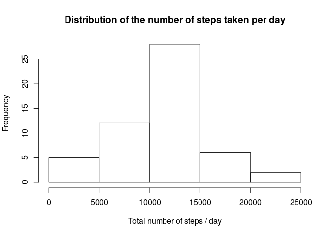
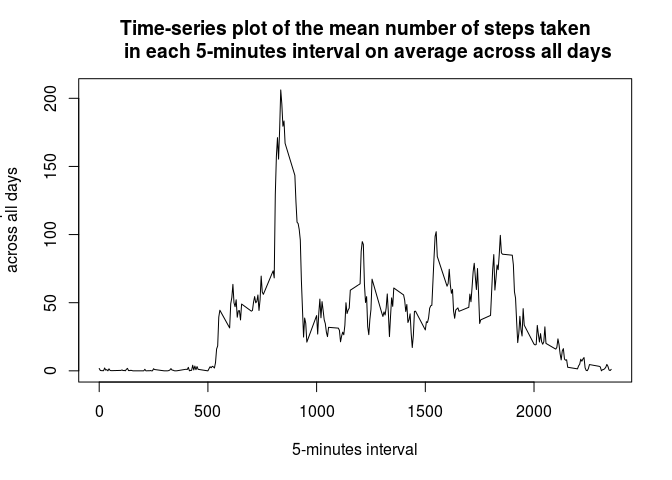
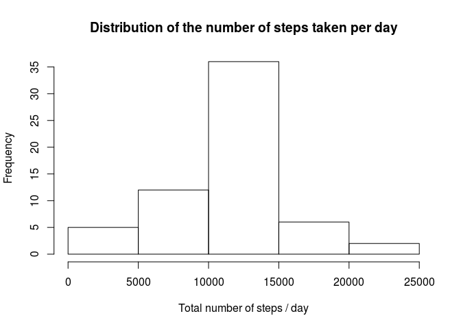
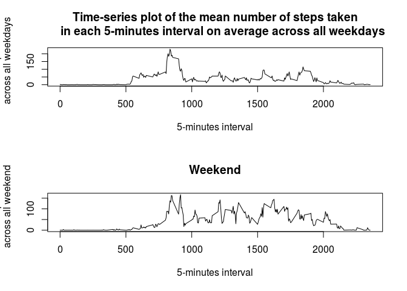

# Reproducible Research: Peer Assessment 1


## Loading and preprocessing the data

```r
Sys.setlocale("LC_TIME", "en_GB.UTF-8")
```

```
## [1] "en_GB.UTF-8"
```

```r
library(knitr)
setwd("/home/cristian/Documents/PhD/lectures/coursera/reproducibleResearch/week1/")
steps <- read.csv("activity.csv")
head(steps)
```

```
##   steps       date interval
## 1    NA 2012-10-01        0
## 2    NA 2012-10-01        5
## 3    NA 2012-10-01       10
## 4    NA 2012-10-01       15
## 5    NA 2012-10-01       20
## 6    NA 2012-10-01       25
```


## What is mean total number of steps taken per day?

```r
library(dplyr)
```

```
## 
## Attaching package: 'dplyr'
```

```
## The following objects are masked from 'package:stats':
## 
##     filter, lag
```

```
## The following objects are masked from 'package:base':
## 
##     intersect, setdiff, setequal, union
```

```r
library(lubridate)
steps$day <- as.numeric(steps$date)
stepsDt <- tbl_df(steps)
stepsDay <- group_by(stepsDt, day)
stepsDayTotal <- summarize(stepsDay, sumSteps = sum(steps))
hist(stepsDayTotal$sumSteps, xlab = "Total number of steps / day", main = 
    "Distribution of the number of steps taken per day")
```



```r
meanSteps <- mean(stepsDayTotal$sumSteps, na.rm = TRUE)
medianSteps <- median(stepsDayTotal$sumSteps, na.rm = TRUE)
```
The mean number of steps taken each day is 1.0766189\times 10^{4}.
The median number of steps taken each day is 10765.


## What is the average daily activity pattern?

```r
stepsInterval <- group_by(stepsDt, interval)
stepsIntervalMean <- summarize(stepsInterval, intervalMean = mean(steps, na.rm = TRUE))
stepsIntervalMean
```

```
## Source: local data frame [288 x 2]
## 
##    interval intervalMean
##       (int)        (dbl)
## 1         0    1.7169811
## 2         5    0.3396226
## 3        10    0.1320755
## 4        15    0.1509434
## 5        20    0.0754717
## 6        25    2.0943396
## 7        30    0.5283019
## 8        35    0.8679245
## 9        40    0.0000000
## 10       45    1.4716981
## ..      ...          ...
```

```r
plot(stepsIntervalMean$interval, stepsIntervalMean$intervalMean, type = "l", 
     xlab = "5-minutes interval", ylab = "Mean number of steps in the interval
     across all days", main = "Time-series plot of the mean number of steps taken
     in each 5-minutes interval on average across all days")
```



```r
stepsMax <- max(stepsIntervalMean$intervalMean)
intervalMax <- stepsIntervalMean$interval[stepsIntervalMean$intervalMean == stepsMax]
```
The 5-minutes interval 835 has the highest average number of steps with 206.1698113 steps taken in that interval on average.


## Imputing missing values

```r
stepsNas <- length(steps$steps[is.na(steps$steps)])
nasIndices <- which(is.na(steps$steps))
for (i in nasIndices) {
    steps$steps[i] <- stepsIntervalMean$intervalMean[stepsIntervalMean$interval == steps$interval[i]]
}
stepsDt <- tbl_df(steps)
stepsDt
```

```
## Source: local data frame [17,568 x 4]
## 
##        steps       date interval   day
##        (dbl)     (fctr)    (int) (dbl)
## 1  1.7169811 2012-10-01        0     1
## 2  0.3396226 2012-10-01        5     1
## 3  0.1320755 2012-10-01       10     1
## 4  0.1509434 2012-10-01       15     1
## 5  0.0754717 2012-10-01       20     1
## 6  2.0943396 2012-10-01       25     1
## 7  0.5283019 2012-10-01       30     1
## 8  0.8679245 2012-10-01       35     1
## 9  0.0000000 2012-10-01       40     1
## 10 1.4716981 2012-10-01       45     1
## ..       ...        ...      ...   ...
```
There are 2304 intervals for which the number of steps taken is not available. Each missing value is replaced by the mean number of steps taken during that interval across all days.
Check that the imputation has worked properly by plotting the time-series plot again. It should be the same as before because the mean in each interval should have remained the same.

```r
stepsInterval <- group_by(stepsDt, interval)
stepsIntervalMean <- summarize(stepsInterval, intervalMean = mean(steps, na.rm = TRUE))
stepsIntervalMean
```

```
## Source: local data frame [288 x 2]
## 
##    interval intervalMean
##       (int)        (dbl)
## 1         0    1.7169811
## 2         5    0.3396226
## 3        10    0.1320755
## 4        15    0.1509434
## 5        20    0.0754717
## 6        25    2.0943396
## 7        30    0.5283019
## 8        35    0.8679245
## 9        40    0.0000000
## 10       45    1.4716981
## ..      ...          ...
```

```r
plot(stepsIntervalMean$interval, stepsIntervalMean$intervalMean, type = "l", 
     xlab = "5-minutes interval", ylab = "Mean number of steps in the interval
     across all days", main = "Time-series plot of the mean number of steps taken
     in each 5-minutes interval on average across all days")
```


The number of NAs is now 0.


```r
stepsDayComplete <- group_by(stepsDt, day)
stepsDayCompleteTotal <- summarize(stepsDayComplete, sumStepsComplete = sum(steps))
hist(stepsDayCompleteTotal$sumStepsComplete, xlab = "Total number of steps / day", main = 
    "Distribution of the number of steps taken per day")
```



```r
meanStepsComplete <- mean(stepsDayCompleteTotal$sumStepsComplete, na.rm = TRUE)
medianStepsComplete <- median(stepsDayCompleteTotal$sumSteps, na.rm = TRUE)
```
The mean number of steps taken each day is now 1.0766189\times 10^{4}, unchanged from before.
The median number of steps taken each day is 1.0766189\times 10^{4}, slightly higher than before.


## Are there differences in activity patterns between weekdays and weekends?

```r
steps$weekday <- weekdays(as.Date(steps$date))
steps$dayType <- rep("weekday", nrow(steps))
steps$dayType[steps$weekday == "Saturday" | steps$weekday == "Sunday"] <- "weekend"
par(mfrow = c(2, 1))
# Weekdays
stepsWeekdays <- tbl_df(steps[steps$dayType == "weekday", ])
stepsWeekdaysInterval <- group_by(stepsWeekdays, interval)
stepsWeekdaysIntervalMean <- summarize(stepsWeekdaysInterval, intervalMean = mean(steps, na.rm = TRUE))
stepsWeekdaysIntervalMean
```

```
## Source: local data frame [288 x 2]
## 
##    interval intervalMean
##       (int)        (dbl)
## 1         0   2.25115304
## 2         5   0.44528302
## 3        10   0.17316562
## 4        15   0.19790356
## 5        20   0.09895178
## 6        25   1.59035639
## 7        30   0.69266247
## 8        35   1.13794549
## 9        40   0.00000000
## 10       45   1.79622642
## ..      ...          ...
```

```r
plot(stepsWeekdaysIntervalMean$interval, stepsWeekdaysIntervalMean$intervalMean, 
     type = "l", xlab = "5-minutes interval", ylab = "Mean number of steps in the interval
     across all weekdays", main = "Time-series plot of the mean number of steps taken
     in each 5-minutes interval on average across all weekdays")
# Weekends
stepsWeekends <- tbl_df(steps[steps$dayType == "weekend", ])
stepsWeekendsInterval <- group_by(stepsWeekends, interval)
stepsWeekendsIntervalMean <- summarize(stepsWeekendsInterval, intervalMean = mean(steps, na.rm = TRUE))
stepsWeekendsIntervalMean
```

```
## Source: local data frame [288 x 2]
## 
##    interval intervalMean
##       (int)        (dbl)
## 1         0  0.214622642
## 2         5  0.042452830
## 3        10  0.016509434
## 4        15  0.018867925
## 5        20  0.009433962
## 6        25  3.511792453
## 7        30  0.066037736
## 8        35  0.108490566
## 9        40  0.000000000
## 10       45  0.558962264
## ..      ...          ...
```

```r
plot(stepsWeekendsIntervalMean$interval, stepsWeekendsIntervalMean$intervalMean, 
     type = "l", xlab = "5-minutes interval", ylab = "Mean number of steps in the    interval
     across all weekend", main = "Weekend")
```


